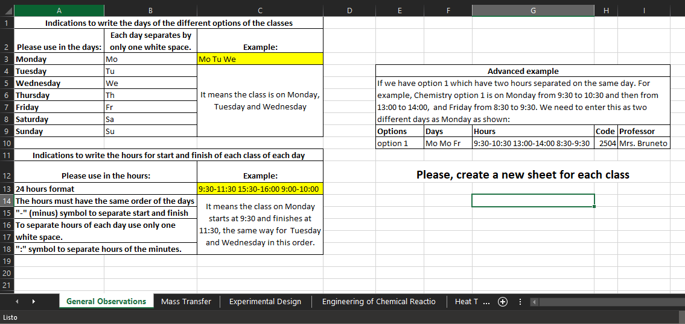
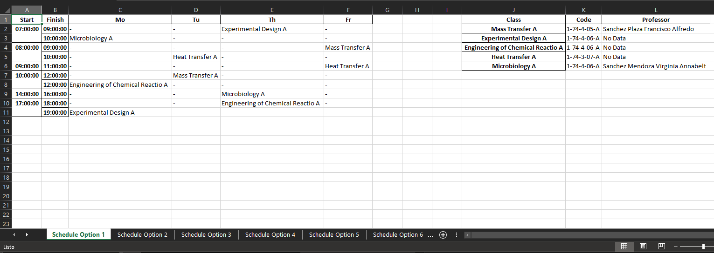

# University Schedule
## Problem
Many universities in Ecuador have a similar method to matriculate their students each semester. In general, all subjects have a code and their schedule, every student must create their own options to their schedules with all classes of the new semester.  
The problem is the obvious difficulty to create the best schedule and other options if one or more classes will not be available at the inscription moment.  
## Solution
This program use the different options of all classes and create all possible options for schedules. The users only need to write the options of their classes in excel file. In a few seconds they will have all possible options to select their favorite and have more options for emergency.  
## Use
To use this program the user must digit all classes in different sheets in an excel file, each sheet has all options with its information. All particular instructions are in examples files in the data folder. The instructions show like this:  
  
The results are in an excel file with one sheet for each option. In the next image you can see a result:

## More information
All details of the project are un detailedExplanation.pynb.  
## Future development  
This project will be updated with some new characteristics like those:  
1) Add filters to schedules with restrictions defined by the user.
2) Create a python file to execute the program more quickly.
3) More features on the way of development.
## Scheduling is more than university
This project is developed for university students, but creating schedules is an important project which can applicate to assign production hours, resource management, and others.